# Báo cáo giữa kỳ — GasSeeker

**Robot tự hành dò tìm vị trí nguồn rò rỉ khí bằng cảm biến đơn**
Đề tài cuối khoá PIFKID · Kho mã nguồn: https://github.com/minhkhang1008/GasSeeker

---

## 1. Giới thiệu sản phẩm

GasSeeker là một **xe tự hành cỡ nhỏ mang một cảm biến khí duy nhất**, có khả năng tự
tìm ra vị trí nguồn phát tán khí trong một khu vực phẳng mà không cần biết trước nguồn ở đâu.

| Thông số | Giá trị |
|---|---|
| Kích thước khu vực khảo sát | 2 × 2 m, chia lưới ô 25 cm |
| Cảm biến khí | MQ-3 (nhạy với hơi ethanol) — **chỉ một** |
| Định vị | Encoder bánh xe + con quay hồi chuyển MPU6050 (dead reckoning) |
| Truyền dữ liệu | LoRa SX1262, băng 923 MHz |
| Chấp hành | 4 motor, điều khiển vi sai hai bên qua 2 × TB6612FNG |
| Số chiến lược dò tìm cài đặt | 3 |
| Thời gian định vị (mô phỏng) | 90 – 280 s tuỳ chiến lược |

Điểm đặc biệt: robot đồng thời đóng **hai vai trò**.

1. **Tự hành tìm nguồn** — chạy hoàn toàn độc lập, không cần máy tính hay sóng LoRa.
2. **Trạm đo di động** — liên tục báo về nồng độ và mức cảnh báo tại từng ô lưới, giúp người
   bên ngoài biết vùng nào an toàn **trước khi** tiếp cận. Nhật ký hành trình vì thế trở thành
   một **bản đồ nhiệt nồng độ** của khu vực.

---

## 2. Lý do thực hiện đề tài

Trong các không gian kín và bán kín — hầm ngầm, cống thoát nước, bể chứa, kho hoá chất —
rò rỉ khí độc (H₂S, CO₂, propan, butan) là nguyên nhân hàng đầu gây ngạt và tử vong. Ba đặc
điểm khiến loại tai nạn này đặc biệt nguy hiểm:

- Khí **không màu, khó nhận biết bằng giác quan**, gây mất ý thức nhanh.
- Người ứng cứu **phải trực tiếp đi vào vùng nguy hiểm** để tìm điểm rò.
- Thời gian tìm ra nguồn càng lâu, lượng khí phát tán càng lớn và rủi ro càng cao.

Robot **không chịu ảnh hưởng sinh học của khí độc**, nên có thể thay con người làm nhiệm vụ
khảo sát và định vị nguồn rò.

Vì lý do an toàn, đề tài **không thí nghiệm với khí độc thật**. Chúng tôi dùng **hơi ethanol**
làm chất mô phỏng: khối lượng phân tử 46 g/mol và hệ số khuếch tán ~0,12 cm²/s của nó nằm gọn
giữa dải của nhóm khí độc mục tiêu (H₂S: 34 / 0,17 · CO₂: 44 / 0,16 · propan: 44 / 0,11 ·
butan: 58 / 0,09), nên trường nồng độ nó tạo ra có **dạng hình học và động học tương đồng**.

> Cách phát biểu chuẩn trong báo cáo: ethanol **không** mô phỏng đặc tính hoá học của khí độc.
> Nó đóng vai trò **nguồn hơi an toàn, dễ phát hiện**, dùng để kiểm thử thuật toán tìm kiếm
> dựa trên sự thay đổi nồng độ trong không gian.

---

## 3. Vấn đề sản phẩm giải quyết

### Bài toán khoa học

> Cho một trường nồng độ khí *C(x, y, t)* chưa biết, sinh ra bởi một nguồn điểm tại vị trí *S*
> chưa biết. Robot chỉ đo được nồng độ **tại một điểm duy nhất** ở thời điểm hiện tại.
> Hãy thiết kế chính sách điều khiển chuyển động sao cho **thời gian hội tụ về S là nhỏ nhất**.

Đây là bài toán *gas source localization* — tìm kiếm với **thông tin cục bộ và nhiễu cao**.

### Câu hỏi nghiên cứu

**Với chỉ một cảm biến khí, chiến lược chuyển động nào giúp robot tìm nguồn nhanh và ổn định
nhất, và điều đó phụ thuộc thế nào vào đặc tính phát tán của môi trường?**

### Ba giả thuyết cần số liệu chứng minh

| Mã | Giả thuyết |
|---|---|
| **H1** | Môi trường **khuếch tán thuần** (không quạt, nồng độ trơn): **bám gradient** nhanh nhất |
| **H2** | Môi trường **phát tán đứt quãng** (có quạt, tín hiệu thành từng cụm): **surge-casting** nhanh nhất |
| **H3** | **Quét toàn bộ** luôn thành công nhưng chậm nhất — dùng làm mốc so sánh |

### Phạm vi có chủ đích

Đề tài giải bài toán **định vị nguồn**, **không** đặt mục tiêu **định danh loại khí** — việc
phân biệt thành phần khí đòi hỏi cảm biến chọn lọc hoặc phổ kế, vượt ngoài phạm vi.

---

## 4. Sơ đồ khối tổng quát

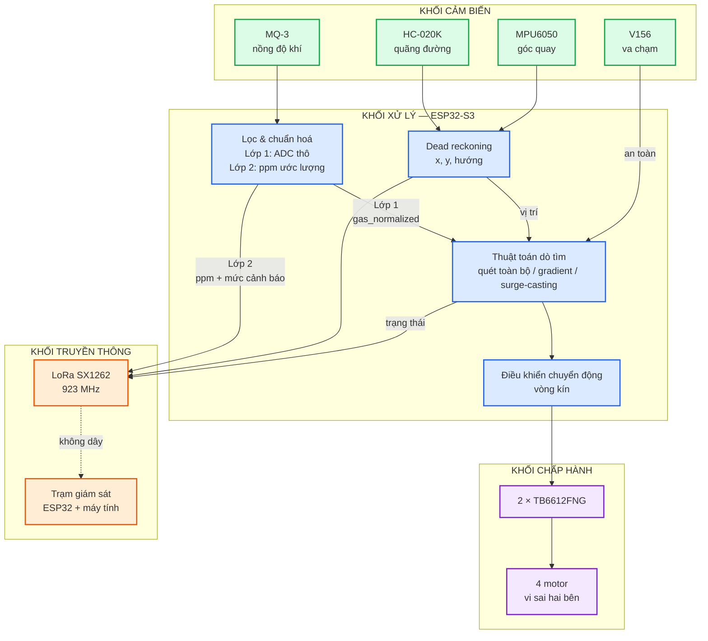

### Điểm thiết kế đáng nói: **hai lớp dữ liệu khí tách biệt**

Robot phục vụ hai mục đích khác nhau nên dữ liệu khí được tách làm hai lớp **độc lập**:

| Lớp | Giá trị | Dùng cho | Yêu cầu độ chính xác |
|---|---|---|---|
| **Lớp 1 — tín hiệu điều khiển** | `gas_raw`, `gas_normalized` (ADC đã lọc) | thuật toán tìm nguồn, điều kiện dừng | chỉ cần **đơn điệu** đúng |
| **Lớp 2 — nồng độ ước lượng** | `ppm_est`, mức cảnh báo | hiển thị cho người giám sát | ước lượng **bậc độ lớn** |

> **Thuật toán không bao giờ dùng ppm.** Phép quy đổi sang ppm là hàm phi tuyến và khuếch đại
> nhiễu ở vùng nồng độ thấp; dùng nó để điều khiển sẽ làm robot kém ổn định. Đây là ràng buộc
> được kiểm tra tự động trong bộ test.

Bốn mức cảnh báo gửi kèm mỗi gói tin: `SAFE` (xanh lá) · `DETECTED` (vàng) · `HIGH` (cam) ·
`CRITICAL` (đỏ), hiển thị bằng LED RGB trên xe và bằng màu ở trạm giám sát.

---

## 5. Sơ đồ nguồn

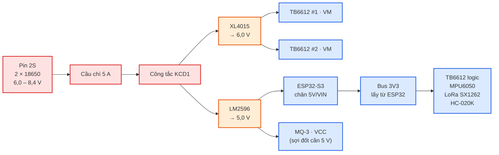

**Ba nguyên tắc an toàn bắt buộc:**

1. **LoRa chỉ dùng 3,3 V** — cấp 5 V là hỏng vĩnh viễn.
2. **Không cấp điện cho LoRa khi chưa gắn ăng-ten** — hỏng tầng khuếch đại công suất.
3. **Đo điện áp ra của buck *trước khi* nối vào board** — buck rẻ hay xuất xưởng ở 12 V.

Tất cả các khối **dùng chung một bus GND**. Tụ lọc: 1000 µF gần VM của TB6612, 470 µF gần
TB6612, 220–470 µF gần ESP32 và gần LoRa, 100 nF rải khắp, và **100 nF hàn thẳng qua hai cực
mỗi motor** để chống nhiễu chổi than làm sai xung encoder.

Sơ đồ đấu nối chi tiết theo từng cụm: [`docs/wiring/`](wiring/).

---

## 6. Giải thuật cơ bản

### 6.1. Khung chung của cả ba chiến lược

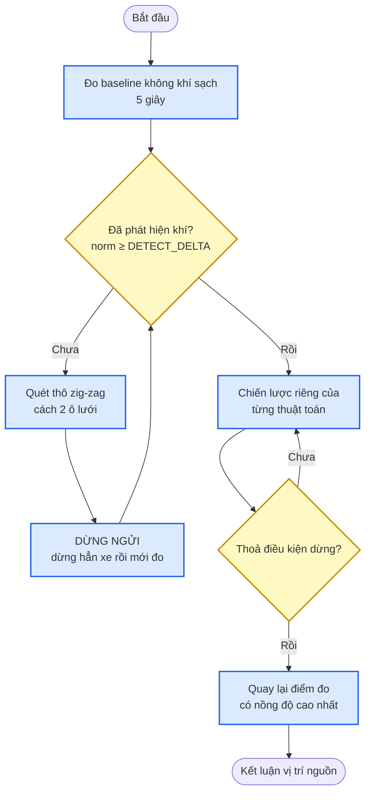

Hai cơ chế dùng chung, **cả hai đều xuất phát từ một đặc tính vật lý của cảm biến MQ-3**:
datasheet ghi thời gian hồi phục **tới 30 giây**.

- **Dừng ngửi.** Mọi phép đo đều dừng hẳn xe rồi mới lấy mẫu (bỏ 1,5 s quá độ, lấy trung bình
  0,8 s). Đo trong lúc xe đang chạy thì giá trị ứng với vị trí *đã đi qua*.
- **Quay lại điểm cao nhất.** Do trễ cảm biến, robot **luôn vượt qua đỉnh rồi mới nhận ra**.
  Khi thoả điều kiện dừng, robot quay lại điểm đo cao nhất rồi mới kết luận.
  *Đo trên mô phỏng: bỏ cơ chế này thì sai số tăng từ ~22 cm lên ~52 cm.*

**Điều kiện dừng phải thoả đồng thời cả ba** (chống dừng nhầm do một lần đọc nhiễu):

```
(a) gas_normalized > STOP_HIGH_DELTA        — đủ cao
(b) không còn tăng quá PLATEAU_EPS          — đã tới đỉnh
(c) duy trì liên tục STOP_HOLD_MS = 6 s     — không phải nhiễu nhất thời
```

### 6.2. Thuật toán 1 — Quét toàn bộ (baseline)

Quét zig-zag hết lưới sân, dừng ngửi tại tâm mỗi ô, ghi lại ô có giá trị cao nhất.
**Không** dừng sớm theo nồng độ — nếu cho dừng sớm thì không còn là baseline nữa.

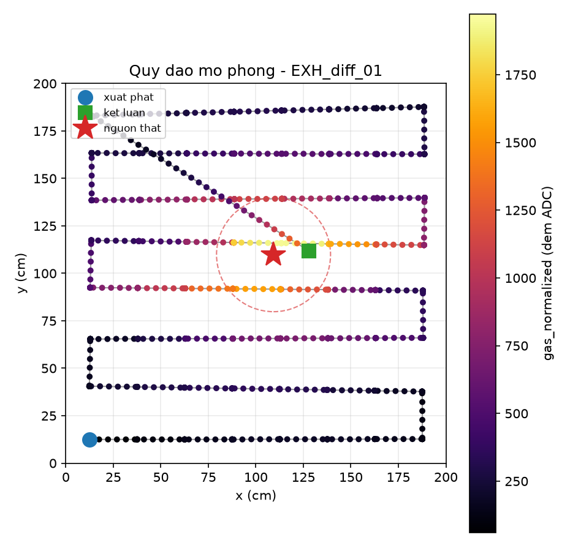

### 6.3. Thuật toán 2 — Bám gradient

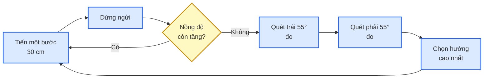

**Vì sao đi thẳng khi còn tăng, chỉ quét 3 hướng khi giảm?** Nếu quét ba hướng liên tục, ba
phép đo cách nhau chỉ vài giây trong khi cảm biến hồi phục mất ~30 s — ba số liệu sẽ lệch theo
**thứ tự đo** chứ không theo không gian. Đi thẳng thì hai phép đo cách nhau 30 cm, chênh lệch
không gian át được độ trễ.

**Vì sao quay tại chỗ lại đo được thông tin không gian?** Đầu dò MQ-3 gắn **lệch về phía trước**
12 cm so với tâm trục. Khi xe quay tại chỗ, đầu dò vẽ một cung tròn nên ba phép đo nằm ở ba vị
trí khác nhau. Gắn cảm biến ngay tâm xe thì quét 3 hướng hoàn toàn vô nghĩa.

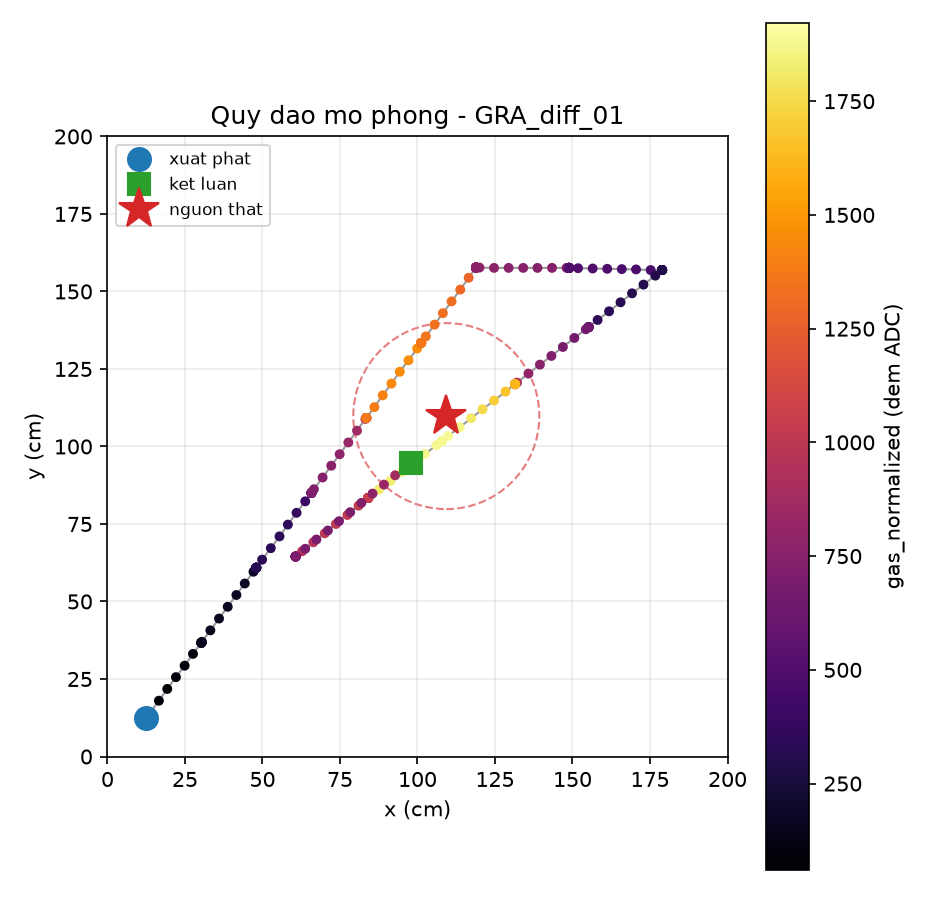

Ảnh trên minh hoạ đúng hiện tượng vượt đỉnh: robot leo gradient, **đi quá nguồn**, rồi quay lại
điểm đo cao nhất (ô vuông xanh) và dừng trong vòng tròn thành công.

### 6.4. Thuật toán 3 — Surge-casting (mô phỏng hành vi côn trùng)

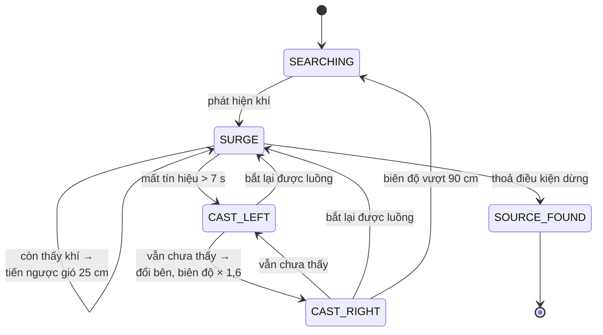

Ý tưởng cốt lõi khiến H2 đúng: khi tín hiệu đứt quãng, **"mất tín hiệu" không còn là thất bại
mà trở thành một hành vi tìm kiếm có định hướng**.

Hướng gió **không** đo bằng cảm biến — nó là hằng số khai báo trước theo cách bố trí quạt trong
sân. Báo cáo phải ghi rõ điều này.

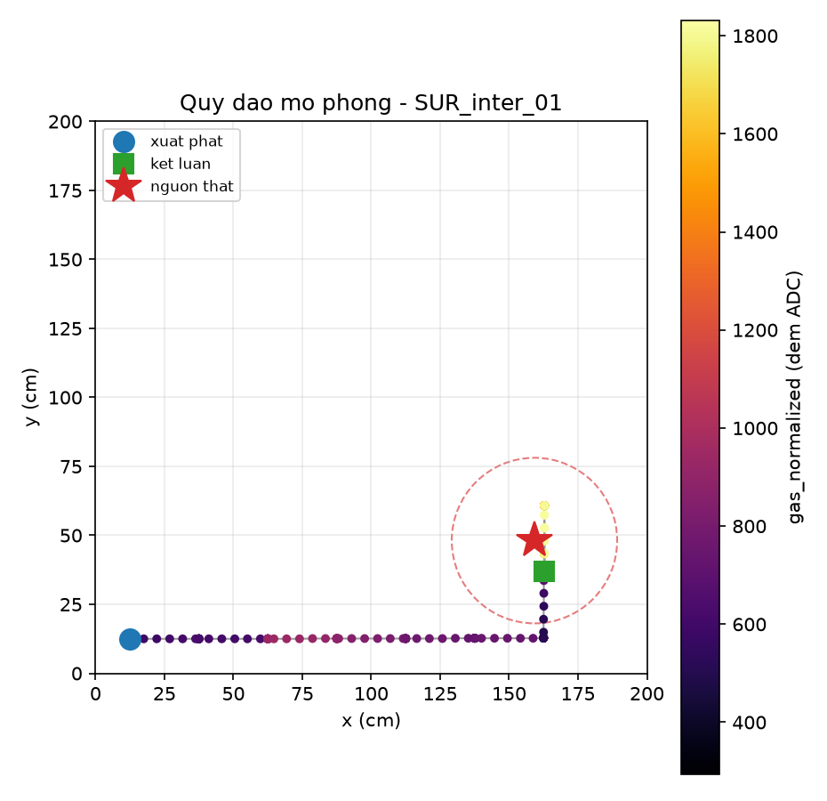

### 6.5. Kiến trúc phần mềm — điểm mạnh kỹ thuật của đề tài

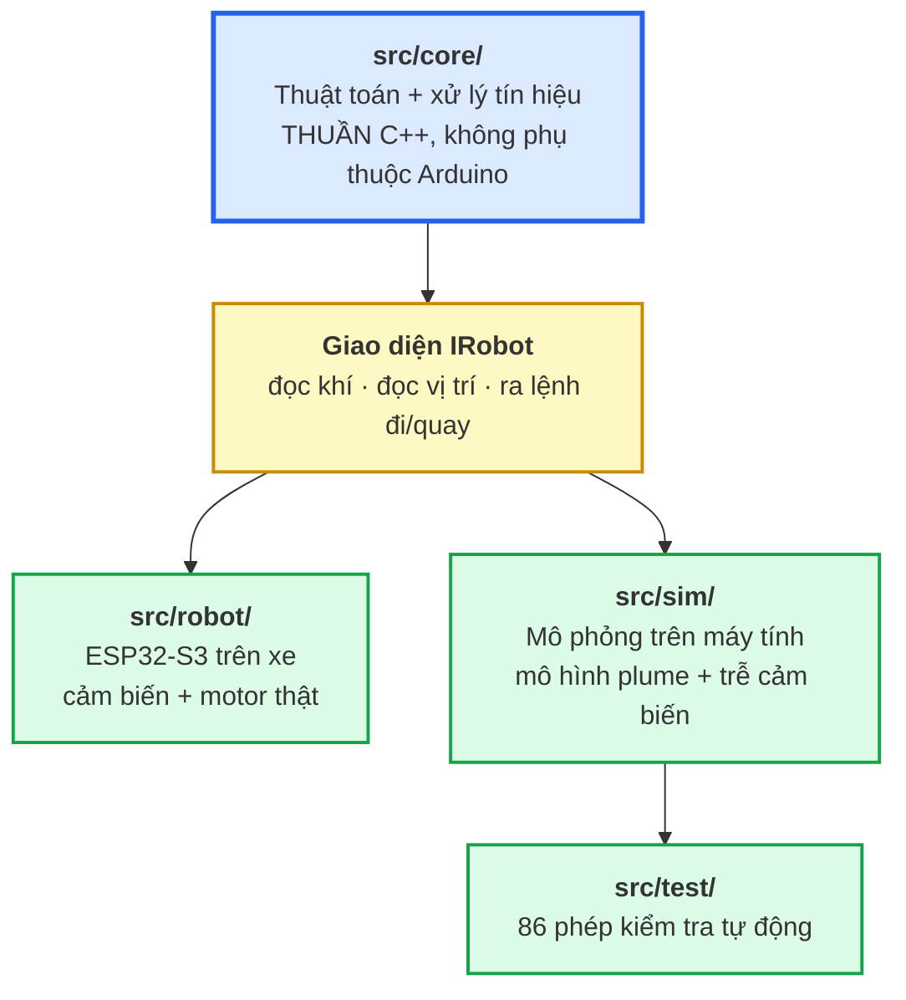

**Cùng một file `.cpp` thuật toán chạy trên cả ESP32 lẫn máy tính.** Không có bản mô phỏng
riêng để lệch với firmware. Nhờ vậy:

- Kiểm chứng và tinh chỉnh thuật toán **trước khi** có phần cứng.
- 86 phép kiểm tra tự động chạy trong 1 giây sau mỗi lần sửa tham số.
- Bộ test đã **bắt được 2 lỗi thật** mà chạy mô phỏng thủ công không phát hiện được.

---

## 7. Tiến độ hoàn thành

### 7.1. Bảng tổng hợp

| Hạng mục | Trạng thái | Ghi chú |
|---|---|---|
| Thuật toán 1 — quét toàn bộ | ✅ Xong | kiểm chứng trên mô phỏng |
| Thuật toán 2 — bám gradient | ✅ Xong | kiểm chứng trên mô phỏng |
| Thuật toán 3 — surge-casting | ✅ Xong | kiểm chứng trên mô phỏng |
| Firmware xe (ESP32-S3) | ✅ Build sạch | ⚠️ chưa chạy trên phần cứng |
| Firmware trạm thu LoRa | ✅ Build sạch | ⚠️ chưa chạy trên phần cứng |
| Chế độ kiểm tra phần cứng `selftest` | ✅ Xong | 8 lệnh chẩn đoán + hiệu chuẩn |
| Bộ test tự động | ✅ 86/86 đạt | chạy native, không cần phần cứng |
| Mô phỏng + bộ công cụ phân tích | ✅ Xong | có bảng số liệu và biểu đồ |
| Tài liệu (wiring, runbook, decisions) | ✅ Xong | hướng dẫn 10 giai đoạn |
| **Lắp ráp phần cứng** | 🔄 **Đang làm** | — |
| **Hiệu chuẩn MQ-3 thật** | ❌ Chưa | phụ thuộc lắp ráp |
| **Số liệu thực nghiệm** | ❌ Chưa | 30 lần chạy dự kiến |

### 7.2. Đã làm được

**Phần thuật toán và phần mềm — hoàn tất.** Ba chiến lược dò tìm được cài đặt đầy đủ, chạy
được trên cả robot thật lẫn mô phỏng nhờ kiến trúc tách lớp. Toàn bộ 5.900 dòng mã, 4 mục tiêu
biên dịch (xe / trạm thu / mô phỏng / test) đều build sạch.

**Mô phỏng cho phép làm việc trước khi có linh kiện.** Chúng tôi xây dựng mô hình trường nồng
độ hai môi trường (khuếch tán trơn và puff đứt quãng), mô hình **trễ bất đối xứng** của MQ-3
(lên nhanh 2,5 s, xuống chậm 8 s) và mô hình sai số dead-reckoning. Nhờ đó đã tinh chỉnh xong
tham số và phát hiện được ba vấn đề thiết kế quan trọng:

1. Trễ cảm biến khiến robot **luôn vượt qua đỉnh** → phải thêm cơ chế quay lại điểm cao nhất.
2. Quét ba hướng liên tục làm số liệu **lệch theo thứ tự đo** → phải đổi sang "thẳng khi tăng,
   quét khi giảm".
3. Surge-casting **kẹt vòng lặp vô hạn** ở góc sân → phải thêm cơ chế chống kẹt.

**Bộ test tự động bắt được lỗi thật.** Sau khi viết 86 phép kiểm tra, hai lỗi mà 10 lần chạy
mô phỏng thủ công không thấy đã lộ ra: bộ chống kẹt bị nhiễu làm mất tác dụng, và pha "quay về"
bị cơ chế xử lý va chạm phá vỡ tạo vòng lặp vô hạn.

**Đối chiếu firmware với phần cứng thật.** Khi tài liệu đấu nối được cập nhật theo linh kiện
thực tế, chúng tôi phát hiện phần cứng chỉ có **một encoder** (thay vì hai như thiết kế ban đầu)
và **một công tắc va chạm**. Điều này gây hai lỗi nếu không sửa: quãng đường bị tính sai một
nửa, và mỗi lần quay tại chỗ robot sẽ tưởng mình vừa đi lùi. Firmware đã được điều chỉnh cho
đúng cấu hình thật.

### 7.3. Kết quả mô phỏng hiện có

10 lần thử × 3 thuật toán × 2 môi trường:

| Thuật toán | Môi trường | Thời gian (s) | Quãng đường (m) | Sai số (cm) | Thành công |
|---|---|---|---|---|---|
| Quét toàn bộ | Khuếch tán | 277 ± 6 | 16,9 ± 0,6 | 22 ± 7 | **10/10** |
| Quét toàn bộ | Đứt quãng | 273 ± 7 | 16,4 ± 0,5 | 39 ± 31 | 5/10 |
| **Bám gradient** | **Khuếch tán** | **100 ± 29** | 4,0 ± 1,2 | 22 ± 15 | 7/10 |
| Bám gradient | Đứt quãng | 90 ± 44 | 4,3 ± 2,3 | 73 ± 36 | 1/10 |
| Surge-casting | Khuếch tán | 103 ± 23 | 4,6 ± 0,9 | 51 ± 24 | 2/10 |
| **Surge-casting** | **Đứt quãng** | **132 ± 63** | 8,1 ± 4,1 | 49 ± 49 | 5/10 |

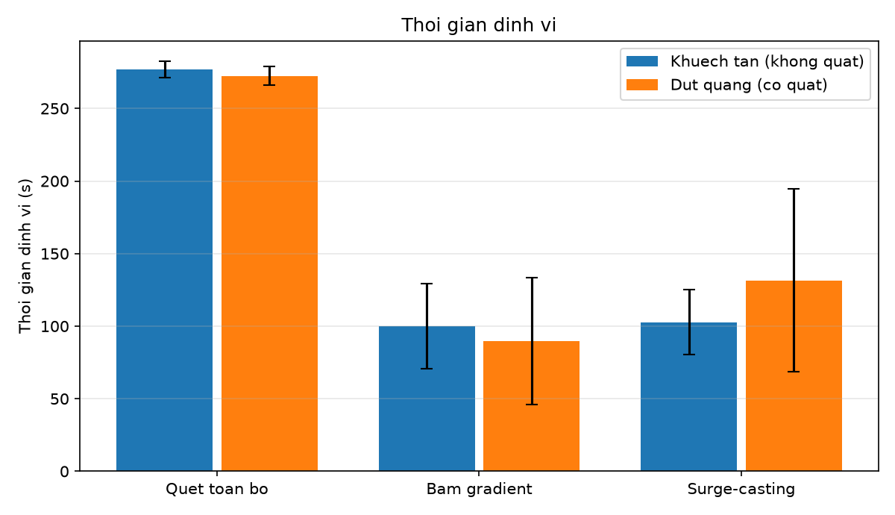
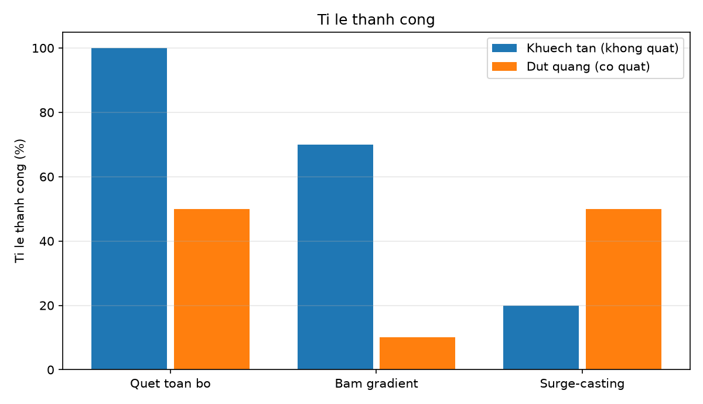

**Xu hướng khớp cả ba giả thuyết:**

- **H1** — trong môi trường khuếch tán, gradient nhanh nhất: **100 s** so với 277 s của quét
  toàn bộ, tức **nhanh gấp 2,8 lần**.
- **H2** — trong môi trường đứt quãng, gradient **hỏng hẳn** (1/10 thành công) đúng như dự đoán,
  còn surge-casting giữ được 5/10 và nhanh gấp đôi quét toàn bộ.
- **H3** — quét toàn bộ đạt 10/10 trong môi trường trơn nhưng chậm nhất và tốn quãng đường gấp
  4 lần.

Sản phẩm phụ — **bản đồ nhiệt nồng độ thô** dựng từ nhật ký hành trình:

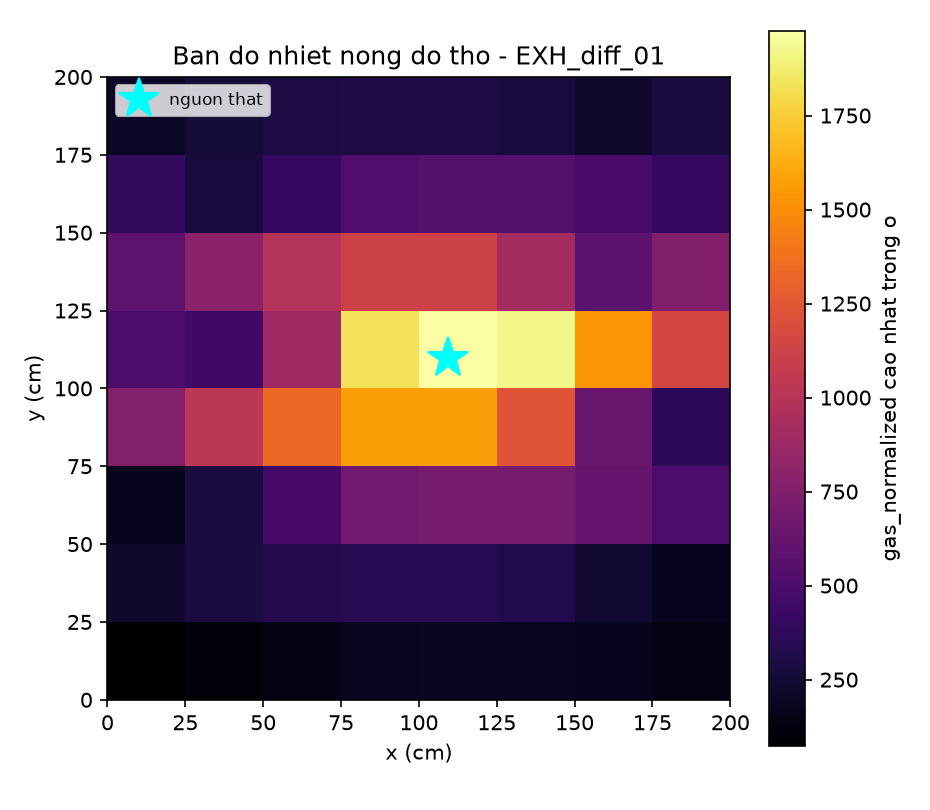

> ⚠️ **Đây là số liệu mô phỏng, không phải đo trên robot thật.** Trong báo cáo cuối, phần này
> phải để mục riêng, tách hẳn khỏi số liệu thực nghiệm.

### 7.4. Chưa làm được

| Hạng mục | Vì sao chưa | Kế hoạch |
|---|---|---|
| Lắp ráp hoàn chỉnh | đang thực hiện | theo hướng dẫn 10 giai đoạn |
| Hiệu chuẩn MQ-3 (`R0`, `A`/`B`, ba ngưỡng) | cần cảm biến thật đã sấy nóng | 2–3 giờ, giai đoạn 6 |
| Hiệu chuẩn chuyển động (đường kính bánh, PID) | cần xe chạy được | 1–2 giờ, giai đoạn 5 |
| 30 lần đo chính thức | cần hai mục trên | 3–4 giờ |
| Kiểm chứng LoRa ở cự ly xa | cần cả hai board hoạt động | cùng buổi đo |

**Rủi ro lớn nhất còn lại:** ba ngưỡng điều khiển (`DETECT_DELTA`, `STOP_HIGH_DELTA`,
`PLATEAU_EPS`) hiện đang là **giá trị phỏng đoán** từ mô hình mô phỏng. Chúng phải được đo lại
trên cảm biến thật, và chúng quyết định robot có chạy được hay không. Quy trình đo đã chuẩn bị
sẵn (đặt robot ở 6 khoảng cách, mỗi vị trí gõ một lệnh, firmware in ra bảng).

**Rủi ro thứ hai:** tầm phát hiện thật của MQ-3 chưa biết. Nếu nó ngắn hơn 35 cm thì robot có
thể đi ngang qua luồng khí mà không nhận ra, và phải giảm bước quét.

---

## 8. Kế hoạch phần còn lại

| Giai đoạn | Nội dung | Thời gian |
|---|---|---|
| 1–3 | Lắp cơ khí, mạch nguồn, đấu tín hiệu | 4–7 giờ |
| 4 | Cấp điện lần đầu + `selftest` | 1 giờ |
| 5 | Hiệu chuẩn chuyển động | 1–2 giờ |
| 6 | **Hiệu chuẩn MQ-3** | 2–3 giờ |
| 7 | Chạy thử ba thuật toán | 1–2 giờ |
| 8 | Đo chính thức 30 lần | 3–4 giờ |
| 9 | Phân tích, biểu đồ, viết báo cáo | 2 giờ |

Chi tiết từng bước: [`docs/RUNBOOK.md`](RUNBOOK.md).

---

## 9. Hạn chế của đề tài (nêu trung thực trong báo cáo)

1. **Chỉ dò được lớp khí sát mặt đất.** Ethanol nặng hơn không khí nên tích tụ ở lớp sát nền —
   đúng vùng cảm biến hoạt động. Với khí **nhẹ hơn không khí** (CH₄, NH₃, H₂), robot bò dưới
   đất sẽ khó phát hiện.
2. **Không định danh được loại khí.** Cảm biến MQ **không chọn lọc** — phản ứng với nhiều hơi
   hữu cơ khác.
3. **`ppm` chỉ là ước lượng bậc độ lớn**, quy đổi theo đường đặc tuyến của nhà sản xuất. Ba
   nguồn sai số: cảm biến không chọn lọc · độ nhạy phụ thuộc nhiệt độ và độ ẩm · `R0` trôi theo
   thời gian.
4. **Hướng gió được khai báo trước**, robot không tự đo.
5. **Sai số dead-reckoning tích luỹ** khoảng 0,5–0,8 % quãng đường — đây là trần thật giới hạn
   kích thước sân ở khoảng 3 × 3 m.
6. **Ethanol là chất mô phỏng**, không phải khí độc thật.

---

## 10. Hướng phát triển

- **Thuật toán lai thích nghi:** tự chuyển giữa gradient và surge-casting dựa trên đặc tính tín
  hiệu đo được (độ liên tục, tần suất mất tín hiệu).
- Bổ sung cảm biến ở **nhiều độ cao** để dò được khí nhẹ hơn không khí.
- Áp dụng **infotaxis / lọc Bayes** — chọn hành động tối đa hoá lượng thông tin thu được.
- **Nhiều robot phối hợp** để rút ngắn thời gian tìm kiếm.