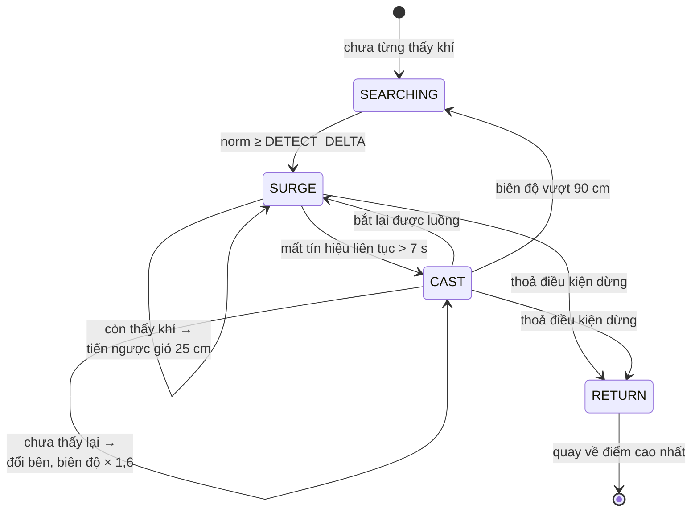

# Giải thích kỹ thuật chi tiết — GasSeeker

Tài liệu này giải thích **tại sao** mỗi quyết định kỹ thuật được đưa ra, không chỉ *cái gì*
đã làm. Dùng để chuẩn bị bảo vệ. Đi kèm [`PHAN_BIEN.md`](PHAN_BIEN.md).

---

# PHẦN I — PHẦN CỨNG

## 1. Vì sao ESP32-S3 chứ không phải Arduino Uno

| Yêu cầu | Arduino Uno | ESP32-S3 |
|---|---|---|
| ADC | 10 bit (1024 mức) | **12 bit (4096 mức)**, có bảng hiệu chuẩn trong eFuse |
| RAM | 2 KB | 320 KB |
| Tốc độ | 16 MHz | 240 MHz, 2 nhân |
| SPI cho LoRa + I²C cho IMU + 2 ngắt encoder | chật vật | thoải mái |

**Điểm quyết định là ADC.** Dải động hữu ích của MQ-3 trong thí nghiệm này khoảng 1500–2500
đếm ADC. Với 10 bit, cùng dải đó chỉ còn ~375–625 mức, mà `PLATEAU_EPS` (ngưỡng "còn tăng hay
không") cần phân giải cỡ 30 đếm — trên Uno sẽ chỉ còn ~7 mức, gần bằng biên độ nhiễu. Thuật
toán gradient sẽ không phân biệt được tín hiệu thật với nhiễu.

ESP32-S3 còn có hàm `analogReadMilliVolts()` dùng bảng hiệu chuẩn nhà máy trong eFuse, cho
điện áp thực chính xác hơn phép quy đổi tuyến tính — cần cho việc tính `Rs` ở Lớp 2.

## 2. Vì sao 4 motor nhưng vẫn là "xe vi sai hai bên"

Xe có 4 motor và 2 module TB6612, nhưng **hai driver dùng chung dây điều khiển**:

```
GPIO5/6/7   →  TB6612#1 kênh A (Front Left)  +  TB6612#2 kênh A (Rear Left)
GPIO15/16/17 → TB6612#1 kênh B (Front Right) +  TB6612#2 kênh B (Rear Right)
```

Hai bánh cùng một bên luôn nhận **cùng một tín hiệu**, nên về mặt điều khiển hệ vẫn chỉ có
**hai biến**: tốc độ bên trái và tốc độ bên phải. Đây chính là mô hình **xe vi sai
(differential drive)**, và firmware không cần thay đổi gì.

**Hệ quả phải nêu trong báo cáo:** xe 4 bánh cố định quay bằng cách **trượt bánh**
(*skid steer*), khác với xe 2 bánh + caster quay quanh tâm trục. Ma sát trượt lớn hơn, góc quay
thực tế sai nhiều hơn nếu tính bằng encoder. **Đó chính là lý do chúng tôi lấy góc từ con quay
hồi chuyển chứ không từ hiệu số encoder.**

## 3. Định vị: vì sao encoder + IMU, không GPS

Môi trường mục tiêu của đề tài là **hầm, cống, bể chứa** — chính là nơi GPS mất tín hiệu. Dùng
GPS để chứng minh ý tưởng cho một môi trường không có GPS là mâu thuẫn về phương pháp.

Phương án đã chọn — **dead reckoning**:

| Đại lượng | Nguồn | Vì sao |
|---|---|---|
| Quãng đường | encoder quang HC-020K | đếm xung trực tiếp, không trôi theo thời gian |
| Góc hướng | tích phân gyro Z của MPU6050 | không bị ảnh hưởng bởi trượt bánh |

**Vì sao không lấy góc từ hiệu số hai encoder?** Công thức `Δθ = (d_phải − d_trái)/L` giả định
bánh **lăn không trượt**. Khi xe 4 bánh quay tại chỗ, bánh **bắt buộc phải trượt ngang** — giả
định bị vi phạm hoàn toàn, sai số góc có thể tới hàng chục độ.

**Cấu hình thực tế chỉ có MỘT encoder** (HC-020K ở bánh sau trái). Điều này kéo theo hai hệ quả
kỹ thuật phải xử lý:

1. Không thể suy góc từ encoder → **MPU6050 trở thành bắt buộc**. Firmware chặn lệnh `start`
   và in cảnh báo nếu không tìm thấy IMU.
2. Encoder một kênh **không biết chiều quay** → chiều được suy ra từ lệnh đang cấp cho motor.
   Điều này tạo ra một **cái bẫy**: khi robot **quay tại chỗ**, bánh trái vẫn quay và encoder
   vẫn đếm xung. Nếu tính `d = số xung × cm/xung × chiều`, robot sẽ tưởng mình vừa **đi lùi**
   một đoạn sau *mỗi* lần quay. Với gradient (quay liên tục), vị trí sẽ trôi rất nhanh.

   **Cách sửa:** khi hai bên được cấp chiều **ngược nhau** (đó chính là định nghĩa của quay tại
   chỗ), quãng đường tịnh tiến bằng **0**:

   ```cpp
   if (dir_trai != dir_phai)  d = 0;        // quay tại chỗ, không tịnh tiến
   else if (có 2 encoder)     d = (dl+dr)/2;
   else                       d = dl;       // chỉ có encoder trái
   ```

   Cách sửa này đúng cho **cả** cấu hình 1 encoder lẫn 2 encoder.

## 4. Mạch đọc MQ-3 — tính toán cụ thể

Chân `AO` của module MQ-3 được cấp 5 V nên có thể xuất tới ~5 V, trong khi GPIO của ESP32-S3
**chỉ chịu được 3,3 V**. Cần chia áp:

```
MQ-3 AO ──[ R1 = 10 kΩ ]──┬── GPIO4 (ADC1_CH3)
                          │
                    [ R2 = 20 kΩ ]
                          │
                         GND
```

Hệ số chia: `k = R2/(R1+R2) = 20/30 = 0,667`

- AO = 5,00 V → GPIO = 3,33 V (sát trần ADC, và MQ-3 hầu như không bao giờ chạm mức này)
- AO = 3,00 V → GPIO = 2,00 V
- AO = 1,00 V → GPIO = 0,67 V

Firmware nhân ngược lại để lấy điện áp AO thật: `V_AO = V_GPIO / 0,667`.

Tụ **100 nF** từ GPIO4 xuống GND tạo bộ lọc thông thấp RC với trở kháng nguồn tương đương
`R1∥R2 = 6,67 kΩ` → tần số cắt `f = 1/(2π·6670·100n) ≈ 239 Hz`. Đủ để chặn nhiễu chuyển mạch
PWM 20 kHz của motor mà không làm chậm tín hiệu khí (vốn thay đổi theo giây).

## 5. Vì sao hai bộ hạ áp riêng biệt

```
Pin 2S ─┬─ XL4015 → 6,0 V → chỉ cấp cho VM của TB6612 (motor)
        └─ LM2596 → 5,0 V → cấp cho ESP32 và sợi đốt MQ-3
```

Motor khởi động rút dòng đỉnh gấp 5–8 lần dòng chạy đều. Nếu dùng chung một bộ hạ áp, sụt áp
tức thời đó sẽ:

- làm ESP32 **reset** (brown-out), hoặc
- làm **sợi đốt MQ-3 hạ nhiệt độ** → điện trở cảm biến thay đổi → **số đọc khí bị nhiễu theo
  chính chuyển động của robot**.

Lỗi thứ hai đặc biệt nguy hiểm vì nó tạo ra **tương quan giả** giữa chuyển động và nồng độ, và
rất khó phát hiện — robot sẽ "thấy" khí mỗi khi tăng tốc. Tách nguồn là cách chặn tận gốc.

Tụ **100 nF hàn thẳng qua hai cực mỗi motor** chặn nhiễu chổi than — nếu bỏ, xung nhiễu sẽ
được encoder quang đếm nhầm thành xung thật, làm quãng đường sai mà triệu chứng trông y hệt
"encoder hỏng".

## 6. LoRa — tham số và lý do

| Tham số | Giá trị | Lý do |
|---|---|---|
| Tần số | 923,0 MHz | băng SRD Việt Nam **920–925 MHz** |
| Công suất | 14 dBm | giới hạn ~25 mW EIRP |
| Bandwidth | 125 kHz | cân bằng cự ly / tốc độ |
| Spreading Factor | SF9 | dự phòng cự ly; airtime ~200 ms cho gói ~70 byte |
| Coding Rate | 4/5 | sửa lỗi nhẹ, ít phí băng thông |

**Vì sao truyền không chặn (non-blocking)?** Hàm `radio.transmit()` của RadioLib **chặn** cho
tới khi phát xong — khoảng 200 ms ở SF9. Trong 200 ms đó vòng điều khiển 50 Hz **đứng hình**,
motor giữ nguyên lệnh cuối. Xe chạy 18 cm/s sẽ **đi lố 3,6 cm mỗi gói tin**. Với telemetry 1 Hz
trong 5 phút, tổng sai lệch lên tới hơn 1 mét.

Giải pháp: dùng `startTransmit()` + cờ ngắt DIO1, vòng lặp chính gọi `poll()` mỗi lượt để hoàn
tất. Vòng điều khiển không bao giờ bị chặn.

**Robot chạy hoàn toàn độc lập nếu mất sóng.** LoRa chỉ để giám sát — đây là ràng buộc thiết kế
bắt buộc từ đề cương, và có lý do thực tế: trong hầm sâu sóng sẽ mất, mà robot vẫn phải hoàn
thành nhiệm vụ.

---

# PHẦN II — CẢM BIẾN KHÍ: PHẦN QUAN TRỌNG NHẤT

## 7. Nguyên lý hoạt động MQ-3

MQ-3 là cảm biến **bán dẫn oxit kim loại (MOX)**, vật liệu nhạy là **SnO₂** (thiếc dioxit).

1. Một **sợi đốt** nung lớp SnO₂ lên 200–400 °C. Đây là lý do cảm biến ăn ~150 mA liên tục và
   cần **sấy nóng 5–10 phút** trước khi số đọc đáng tin.
2. Ở nhiệt độ đó, oxy trong không khí **hấp phụ** lên bề mặt SnO₂ và bắt giữ electron dẫn
   → lớp nghèo electron → **điện trở cao**.
3. Khi có khí khử (ethanol, CO, H₂...), nó **phản ứng với oxy hấp phụ**, giải phóng electron
   trở lại → **điện trở giảm**.

Vậy: **nồng độ tăng → Rs giảm**. Đây là quan hệ nghịch biến, và nó **phi tuyến**.

### Đo Rs bằng mạch chia áp

Module có điện trở tải `RL` nối tiếp với cảm biến:

```
VC (5V) ── [ Rs (cảm biến) ] ──┬── AO
                               │
                          [ RL (tải) ]
                               │
                              GND
```

Từ đó: **Rs = (VC − V_AO) / V_AO × RL**

`RL` **phải đo bằng đồng hồ** trên chính module đang dùng — module khác nhau lắp 1 kΩ, 4,7 kΩ
hoặc 10 kΩ. Sai `RL` thì `ppm` sai cả bậc độ lớn.

### Quy đổi sang ppm

Datasheet cho đường đặc tuyến trên giấy **log-log**, tại đó nó là **đường thẳng**:

```
ratio = Rs / R0            R0 = Rs trong không khí sạch
ppm   = A × ratio^B        B < 0 (nghịch biến)
```

Hai hằng số `A`, `B` fit từ hai điểm đọc trên đồ thị:

```
B = log10(ppm₂/ppm₁) / log10(ratio₂/ratio₁)
A = ppm₁ / ratio₁^B
```

Giá trị hiện dùng (`A = 315,2`, `B = −1,865`) fit từ hai điểm **đọc thô** trên đồ thị ethanol:
(0,1 mg/L; Rs/R0 = 2,6) và (10 mg/L; Rs/R0 = 0,22), quy đổi 1 mg/L ethanol ≈ 531 ppm ở 25 °C
theo `ppm = (mg/m³) × 24,45 / 46,07`.

**`R0` được tự hiệu chuẩn mỗi lần bật máy** từ chính giai đoạn đo baseline:
`R0 = Rs_không_khí_sạch / 60` (tỉ số 60 lấy từ datasheet MQ-3). Lý do: datasheet ghi rõ `R0`
**trôi theo thời gian sử dụng**, nên hiệu chuẩn lại mỗi buổi là đúng khuyến cáo nhà sản xuất.

## 8. Vì sao tách hai lớp dữ liệu — và vì sao đây là điểm thiết kế quan trọng

| Lớp | Giá trị | Dùng cho | Yêu cầu |
|---|---|---|---|
| **Lớp 1** | `gas_raw`, `gas_normalized` (đếm ADC) | thuật toán, điều kiện dừng | chỉ cần **đơn điệu** đúng |
| **Lớp 2** | `ppm_est`, mức cảnh báo | hiển thị cho người | **bậc độ lớn** |

**Lập luận toán học vì sao không được dùng ppm để điều khiển.** Từ `ppm = A·ratio^B` với
`B = −1,865`, đạo hàm tương đối:

```
d(ppm)/ppm = B × d(ratio)/ratio
```

Nghĩa là **sai số tương đối của `ratio` bị khuếch đại 1,865 lần** khi sang ppm. Ở vùng nồng độ
thấp — chính là vùng robot làm việc khi mới bắt được luồng khí — `Rs` lớn, `V_AO` nhỏ, sai số
tương đối của phép đo ADC lớn nhất. Đưa ppm vào điều kiện dừng nghĩa là đưa vào một đại lượng
đã bị khuếch đại nhiễu gần gấp đôi, để **quyết định một việc chỉ cần biết tăng hay giảm**.

Thuật toán chỉ cần ba thông tin, cả ba đều lấy được từ Lớp 1: nồng độ **đang tăng hay giảm**,
**có** phát hiện khí không, và giá trị đã **đủ cao** chưa.

Ràng buộc này được **kiểm tra tự động** trong bộ test (nhóm 3).

## 9. Độ trễ của cảm biến — vấn đề trung tâm của cả đề tài

Datasheet MQ-3 ghi: **thời gian đáp ứng ≤ 10 s, thời gian hồi phục ≤ 30 s**. Mô hình hoá bằng
khâu quán tính bậc nhất **bất đối xứng**:

```
dy/dt = (c − y) / τ        với  τ = τ_lên  khi c > y  (≈ 2,5 s)
                                τ = τ_xuống khi c < y  (≈ 8 s)
```

Bất đối xứng vì cơ chế vật lý khác nhau: khí **phản ứng** với oxy hấp phụ thì nhanh, nhưng oxy
**hấp phụ trở lại** lên bề mặt thì chậm.

### Hệ quả 1 — bắt buộc phải "dừng ngửi"

Nếu đo trong lúc xe chạy ở 18 cm/s, giá trị đọc được **trễ** so với vị trí thật một khoảng:

```
Δs ≈ v × τ = 18 cm/s × 2,5 s ≈ 45 cm
```

45 cm là gần **hai ô lưới**. Giá trị đọc được sẽ ứng với một vị trí robot đã đi qua từ lâu —
không ứng với vị trí nào có ý nghĩa cả. Mọi kết luận không gian đều sai.

**Giải pháp:** mọi phép đo đều **dừng hẳn xe**, bỏ 1,5 s quá độ, rồi lấy trung bình trong 0,8 s.
Giá cho việc này: mỗi phép đo tốn 2,3 s, quét toàn bộ 64 ô mất ~4,6 phút.

### Hệ quả 2 — robot luôn vượt qua đỉnh

Ngay cả khi dừng ngửi, 1,5 s vẫn ngắn so với τ_xuống = 8 s, nên số đọc còn mang "ký ức" của
vị trí trước. Robot chỉ nhận ra "đã qua đỉnh" sau khi đã đi quá 1–2 bước.

**Giải pháp:** khi thoả điều kiện dừng, robot **quay lại điểm đo cao nhất** rồi mới kết luận.

> **Đo được trên mô phỏng:** tắt cơ chế này, sai số của gradient tăng từ ~22 cm lên ~52 cm.
> Ảnh `quydao_gradient.png` minh hoạ đúng hiện tượng: robot leo gradient, đi vượt qua nguồn,
> rồi quay lại điểm cao nhất và dừng trong vòng tròn thành công.

### Hệ quả 3 — không được quét ba hướng liên tục

Xem mục 12.

## 10. Lọc và baseline

```
gas_raw        = trung bình trượt 16 mẫu ADC (lấy mẫu 20 Hz → cửa sổ 0,8 s)
gas_normalized = gas_raw − baseline
```

**Baseline đo một lần lúc khởi động, trong 5 giây, và KHÔNG tự trôi.** Đây là lựa chọn có chủ
đích: baseline thích nghi (adaptive) sẽ **"nuốt" mất tín hiệu** khi robot ở lâu trong vùng có
khí — đúng lúc cần nhất thì nó lại coi nồng độ cao là mức nền mới. Đổi lại, có lệnh `cal` để
đo lại giữa buổi.

Cửa sổ 0,8 s được chọn vì nó **ngắn hơn nhiều** so với hằng số thời gian của cảm biến (2,5–8 s),
nên bộ lọc không làm chậm thêm tín hiệu — nó chỉ loại nhiễu ADC.

---

# PHẦN III — BA THUẬT TOÁN

## 11. Thuật toán 1 — Quét toàn bộ (baseline)

Quét zig-zag (boustrophedon) hết lưới, dừng ngửi tại tâm mỗi ô, ghi ô cao nhất, cuối cùng quay
về ô đó.

**Độ phức tạp:** số ô = `A/d²` với `A` là diện tích, `d` là cạnh ô. Thời gian:

```
T ≈ (A/d²) × (t_ngửi + t_phanh + d/v)
  = (A/d²) × (2,3 + 0,25 + d/18)  giây
```

Với A = 4 m², d = 25 cm → 64 ô × 4,3 s ≈ **277 s**. Số đo mô phỏng: 277 ± 6 s. Khớp.

**Nó cố tình KHÔNG dừng sớm theo nồng độ.** Cho nó dừng sớm thì nó không còn là baseline nữa và
mất ý nghĩa so sánh cho H3. Bộ test có một trường hợp riêng đặt nguồn **ngay cạnh điểm xuất
phát** và kiểm tra rằng robot vẫn quét hết lưới.

## 12. Thuật toán 2 — Bám gradient (chemotaxis)

### Cơ chế

```
Tiến 30 cm → dừng ngửi
   ├─ còn tăng (> PLATEAU_EPS) → giữ nguyên hướng, tiến tiếp
   └─ đã giảm → quét trái 55°, quét phải 55° → chọn hướng cao nhất → tiến
```

### Vì sao không quét ba hướng ở *mỗi* bước

Đề cương gợi ý bản "quét 3 hướng" ổn định hơn. Trên lý thuyết đúng — nhưng với cảm biến có
τ_xuống = 8 s thì **sai**:

Ba phép đo (giữa → trái → phải) cách nhau chỉ ~4 s mỗi lần. Trong 4 s, số đọc mới hồi phục
`1 − e^(−4/8) = 39 %` quãng đường về giá trị đúng. Nghĩa là phép đo thứ ba vẫn còn mang **61 %
ảnh hưởng** của phép đo thứ hai. Ba số liệu sẽ lệch **theo thứ tự đo**, không theo không gian —
robot sẽ luôn thiên về một bên, bất kể nguồn ở đâu.

**Giải pháp lai:** đi thẳng khi còn tăng (hai phép đo cách nhau **30 cm** và ~5 s — chênh lệch
không gian át được độ trễ), chỉ bỏ công quét ba hướng khi đã giảm, tức khi thực sự cần thông
tin hướng.

### Vì sao quay tại chỗ lại đo được thông tin không gian

Đây là điểm reviewer hay hỏi. Đầu dò MQ-3 gắn **lệch về phía trước 12 cm** so với tâm trục
(`SENSOR_OFFSET_CM`). Khi xe quay tại chỗ ±55°, đầu dò vẽ một **cung tròn bán kính 12 cm**:

```
khoảng cách giữa hai vị trí đo trái và phải = 2 × 12 × sin(55°) ≈ 19,7 cm
```

Gần 20 cm — cùng bậc với bước tiến 30 cm. **Nếu gắn cảm biến ngay tâm trục, quay tại chỗ không
làm đầu dò đổi vị trí, và quét ba hướng hoàn toàn vô nghĩa.**

### Điểm yếu cố ý để lộ

Một khi vào chế độ bám gradient, nếu tín hiệu đứt quãng thì gradient **không có cơ chế tìm
lại** — nó chỉ đi lang thang. Đây chính là điều H2 nói tới, và là lý do tồn tại của thuật toán
thứ ba. Số liệu mô phỏng xác nhận: gradient chỉ thành công **1/10** trong môi trường đứt quãng.

## 13. Thuật toán 3 — Surge-casting (giải thích kỹ)

### 13.1. Vấn đề mà nó giải quyết

Trong môi trường **có gió/rối**, luồng khí **không** phải một đám mây trơn giảm đều theo khoảng
cách. Nó bị xé thành các **sợi khí rời rạc (filament)** trôi theo gió:

```
        nguồn ★
          ║
   gió ←──╫──────────────────────
          ║   ▓  ▒     ▓   ▒  ▓      ← các sợi khí rời rạc
          ║ ▒   ▓   ▒     ▓    ▒
          ║   ▓    ▒   ▓     ▒   ▓
             ↑
        cảm biến đứng đây thấy: 0, 0, 850, 0, 0, 0, 1200, 0, 300, 0 ...
```

Hệ quả chí mạng cho gradient: **nồng độ đo được không còn giảm đơn điệu theo khoảng cách tới
nguồn.** Một điểm xa nguồn nhưng đúng lúc có sợi khí đi qua sẽ đọc cao hơn một điểm gần nguồn
nhưng đang ở khoảng trống. Bám gradient trong trường này chính là **bám nhiễu**.

### 13.2. Ý tưởng sinh học

Bướm đêm đực tìm được bướm cái qua pheromone ở khoảng cách hàng trăm mét, trong gió rối, chỉ
với hai râu. Nó không tính gradient. Nó dùng **hai hành vi luân phiên**:

- **Surge** (lao tới): *đang ngửi thấy* → bay thẳng **ngược hướng gió**.
- **Cast** (quét ngang): *mất mùi* → bay **ngang qua hướng gió**, biên độ tăng dần, cho tới khi
  bắt lại được mùi.

### 13.3. Vì sao nó hoạt động — lập luận cốt lõi

Trong trường rối, nồng độ tại một điểm là **ngẫu nhiên**. Nhưng có **một thông tin luôn đúng**:

> Nếu ngửi thấy khí, thì nguồn nằm ở **phía đầu gió**.

Đây là ràng buộc **nhân quả**, không phải thống kê — khí không thể tự đi ngược gió. Surge-casting
khai thác đúng thông tin này, thay vì cố suy ra gradient từ dữ liệu quá nhiễu.

Còn khi **mất tín hiệu**, điều đó cũng mang thông tin: luồng khí là một **dải hẹp** theo hướng
gió, nên mất tín hiệu nghĩa là robot **đã đi ra khỏi bề ngang của dải**. Cách hợp lý để tìm lại
là quét **vuông góc** với hướng gió — chứ không phải đi tiếp hay quay đầu.

**Đó là câu chốt của thuật toán:** *"mất tín hiệu" chuyển từ một thất bại thành một hành vi tìm
kiếm có định hướng.*

### 13.4. Máy trạng thái đã cài đặt



### 13.5. Bốn tham số và lý do chọn

**a) `SC_SURGE_STEP_CM = 25`** — mỗi bước tiến ngược gió. Bằng một ô lưới. Ngắn hơn thì tốn
nhiều lần dừng ngửi; dài hơn thì dễ phóng qua nguồn.

**b) `SC_LOST_MS = 7000` — "quán tính" giữ hướng khi vừa mất tín hiệu.**
Đây là tham số tinh tế nhất. Trong plume rối, **khoảng trống giữa hai sợi khí là chuyện bình
thường**, không có nghĩa là robot đã ra khỏi luồng. Nếu chuyển sang cast ngay khi mất một lần
đo, robot sẽ dao động liên tục và không tiến được. 7 s ≈ **hai chu kỳ đo liên tiếp** không thấy
khí mới coi là thật sự mất luồng. Đây chính là hành vi "quán tính" của con bướm.

**c) `SC_CAST_STEP_CM = 15` và `SC_CAST_GROWTH = 1,6`** — biên độ cast tăng theo cấp số nhân:

| Lần cast | 1 | 2 | 3 | 4 | 5 |
|---|---|---|---|---|---|
| Biên độ (cm) | 15 | 24 | 38 | 61 | 98 → vượt trần |
| Bên | trái | phải | trái | phải | — |

Vì sao **tăng dần** chứ không quét biên độ cố định? Vì robot **không biết mình lệch khỏi luồng
bao xa**. Bắt đầu nhỏ để bắt lại nhanh trong trường hợp lệch ít (phổ biến nhất); tăng theo cấp
số nhân để vẫn phủ được trường hợp lệch nhiều mà không tốn quá nhiều lần thử. Tổng bề ngang
quét được sau *n* lần ≈ `A₀(g^n − 1)/(g − 1)`; với 5 lần đã phủ ±120 cm.

Vì sao **đổi bên** mỗi lần? Vì không biết luồng ở bên trái hay bên phải.

**d) `SC_CAST_MAX_CM = 90`** — quá ngưỡng này thì giả thuyết "chỉ lệch khỏi luồng" không còn
hợp lý; nhiều khả năng robot đã ra khỏi vùng phát tán. Quay về pha SEARCHING quét thô.

### 13.6. Hai lỗi thật đã gặp khi phát triển (đáng kể trong báo cáo)

**Lỗi 1 — kẹt vòng lặp vô hạn ở góc sân.** Robot tiến ngược gió tới mép sân, không tiến được
nữa → chuyển sang cast → cast lại phát hiện khí → **reset biên độ về 15 cm** → lại thử tiến
ngược gió → lại bị chặn → lặp mãi tới hết giờ.
*Sửa:* khi hướng ngược gió bị chặn bởi biên sân, **buộc biên độ cast phải tăng** — vì nếu vẫn
ngửi thấy khí mà không tiến được, nguồn chắc chắn nằm **lệch sang một bên**.

**Lỗi 2 — pha "quay về" bị phá.** Robot kết luận → quay về điểm cao nhất → **đụng tường** → cơ
chế xử lý va chạm quẳng nó trở lại pha SURGE → tìm lại → kết luận lại → lặp vô hạn.
*Sửa:* pha `RETURN` là pha **cuối cùng**. Va chạm trong pha này → dừng luôn tại chỗ. Kết luận
là **điểm đã ghi lại**, việc về được tận nơi chỉ là cố gắng thêm.

Cả hai lỗi do **bộ test tự động** phát hiện, không phải do chạy mô phỏng thủ công.

### 13.7. Vì sao surge-casting KÉM trong môi trường trơn

Số liệu: chỉ **2/10** thành công trong môi trường khuếch tán, so với 7/10 của gradient.

Lý do: trong môi trường không quạt, **không có gió**, nhưng thuật toán vẫn tiến theo một hướng
"ngược gió" khai báo cứng. Nó **cố tình bỏ qua** thông tin gradient vốn rất tốt trong trường
trơn. Đây không phải lỗi — đây là **bằng chứng cho H1**: mỗi chiến lược chỉ tối ưu trong đúng
môi trường mà giả định của nó thoả mãn.

## 14. Điều kiện dừng — vì sao cần cả ba

```
(a) gas_normalized > STOP_HIGH_DELTA     — đủ cao
(b) không còn tăng quá PLATEAU_EPS       — đã tới đỉnh
(c) duy trì liên tục STOP_HOLD_MS = 6 s  — không phải nhiễu nhất thời
```

Bỏ **(a)**: robot dừng ở bất kỳ cực đại địa phương nào, kể cả cách nguồn hàng mét.
Bỏ **(b)**: robot dừng ngay khi vừa vượt ngưỡng, trong khi còn có thể tiến gần hơn.
Bỏ **(c)**: một lần đọc nhiễu cũng làm robot kết luận sai — đây chính là cảnh báo trong đề cương.

**Chi tiết cài đặt đáng nói:** đồng hồ của điều kiện (c) chỉ khởi động từ **phép đo thứ hai**,
vì phải có hai phép đo mới kết luận được "không còn tăng". Thời gian tối thiểu để dừng =
một chu kỳ đo + 6 s. Ràng buộc này được kiểm tra tự động (bộ test nhóm 2).

## 15. Chống kẹt — `StallGuard`

Sau 12 phép đo liên tiếp **không tiến triển**, robot kết luận bằng điểm cao nhất đã đo thay vì
chạy tới hết giờ.

**Điểm tinh tế:** "kỷ lục mới" **không** đồng nghĩa với "tiến triển". Phiên bản đầu reset bộ đếm
mỗi khi có giá trị cao hơn kỷ lục cũ — kể cả cao hơn 1 đếm ADC do nhiễu. Trong trường nhiễu,
điều đó xảy ra gần như liên tục nên bộ đếm **không bao giờ đầy**, và cơ chế chống kẹt mất tác
dụng hoàn toàn. Bản sửa chỉ reset khi vượt kỷ lục **quá `PLATEAU_EPS`** — dùng chung ngưỡng
"còn tăng" với mọi chỗ khác. Việc *ghi lại* điểm cao nhất vẫn dùng ngưỡng 0 (chính xác tuyệt
đối); hai khái niệm này được tách biệt trong mã.

## 16. Giai đoạn SEEK dùng chung — và vì sao phải nói rõ

Khi **chưa hề** phát hiện khí, cả gradient lẫn surge-casting đều quét thô zig-zag (cách 2 ô)
cho tới khi bắt được tín hiệu đầu tiên.

**Vì sao dùng chung:** nếu để mỗi thuật toán tự xoay xở lúc chưa có tín hiệu, bảng so sánh sẽ
đo lẫn cả "khả năng dò mù" — vốn không phải điều H1/H2 nói tới. H1 và H2 nói về hành vi **sau
khi** bắt được luồng khí. Dùng chung giai đoạn SEEK là cách **cô lập biến** để so sánh công bằng.

**Đây là một lựa chọn của nhóm, không phải điều hiển nhiên, nên phải ghi rõ trong báo cáo.**

---

# PHẦN IV — KIẾN TRÚC PHẦN MỀM

## 17. Đảo ngược phụ thuộc qua giao diện `IRobot`

```
src/core/  (thuật toán, THUẦN C++)  ──→  IRobot (giao diện)
                                            ↑            ↑
                                     RobotIO         SimRobot
                                   (ESP32 thật)   (mô phỏng)
```

`IRobot` có đúng 10 hàm: đọc thời gian, đọc khí, đọc vị trí, đọc quãng đường, tiến, quay, dừng,
hỏi bận, hỏi va chạm, ghi log. Thuật toán **không được** gọi gì khác.

**Lợi ích cụ thể, đo được:**

- Cùng một file `.cpp` chạy trên cả xe lẫn máy tính → không có chuyện "bản mô phỏng khác bản
  thật".
- Tinh chỉnh tham số **trước khi** có phần cứng: 60 lần chạy mô phỏng mất 40 giây, cùng số lần
  đó trên xe thật mất hơn 4 giờ và tốn cồn.
- Bộ test 86 phép kiểm tra chạy trong 1 giây sau **mỗi** lần sửa `config.h`.

## 18. Vòng lặp không chặn

Ba thuật toán đều là **máy trạng thái**, hàm `update()` trả về ngay lập tức. **Không có
`delay()`, không có vòng `while` chờ.**

Vì sao bắt buộc: vòng lặp chính phải đồng thời lấy mẫu khí ở 20 Hz, cập nhật odometry ở 100 Hz,
điều khiển motor ở 50 Hz, đọc nút, và phục vụ LoRa. Một lệnh `delay(1000)` sẽ làm mất 20 mẫu
khí và khiến bộ điều khiển giữ hướng mất kiểm soát trong 1 giây.

## 19. Bộ test tự động

86 phép kiểm tra chia 8 nhóm. Quan trọng nhất là **nhóm 7**: chạy 3 thuật toán × 2 môi trường ×
4 vị trí nguồn (kể cả sát góc sân) và **bắt buộc mọi lần đều phải kết thúc**, không được chạy
hết giờ.

Nhóm này đã bắt được cả hai lỗi ở mục 13.6 — những lỗi mà 10 lần chạy mô phỏng thủ công trước
đó không phát hiện, vì chúng chỉ xuất hiện với vị trí nguồn đặc biệt.

---

# PHẦN V — THIẾT KẾ THỰC NGHIỆM

## 20. Bốn chỉ số và ý nghĩa

| Chỉ số | Đo cái gì | Vì sao cần |
|---|---|---|
| **Thời gian định vị** | từ xuất phát đến khi kết luận | chỉ số chính — đúng câu hỏi nghiên cứu |
| Sai số định vị | khoảng cách điểm kết luận ↔ nguồn thật | nhanh mà sai thì vô nghĩa |
| Tỉ lệ thành công | số lần sai số ≤ 30 cm | phân biệt "nhanh" với "may" |
| Quãng đường | đại diện năng lượng tiêu thụ | ràng buộc thực tế của robot chạy pin |

Cần **cả bốn** vì chúng đánh đổi lẫn nhau: quét toàn bộ thắng về tỉ lệ thành công nhưng thua về
thời gian và quãng đường; gradient ngược lại.

## 21. Cô lập biến

- **Cùng seed → cùng vị trí nguồn** cho cả ba thuật toán: ba thuật toán gặp **đúng cùng một bài
  toán**, không có chuyện thuật toán này gặp vị trí dễ hơn.
- **Cùng giai đoạn SEEK** (mục 16).
- **Cùng điểm xuất phát và hướng ban đầu** cho mọi lần chạy.
- **Cùng thể tích cồn** cho mọi lần thử.

## 22. Sai số dead-reckoning và trần kích thước sân

Đo trên mô phỏng: độ trôi ≈ **0,5–0,8 % quãng đường** (10 cm sau 17 m; 50 cm sau 64 m).

Vì bán kính thành công là 30 cm, quãng đường phải dưới ~40 m → **sân tối đa khoảng 3 × 3 m**
với ô 25 cm. Đây là **trần thật** của hệ, không phải thời gian.

| Sân | Thời gian quét toàn bộ | Thành công |
|---|---|---|
| 1,5 × 1,5 m | 158 s | 6/6 |
| **2,0 × 2,0 m** | **279 s** | **6/6** |
| 2,5 × 2,5 m | 429 s | 3/6 |
| 3,0 × 3,0 m | 611 s | 2/6 |

Chọn 2 × 2 m vì đó là điểm cân bằng: đủ lớn để ba thuật toán khác biệt rõ, đủ nhỏ để độ trôi
odometry chưa lấn át.
