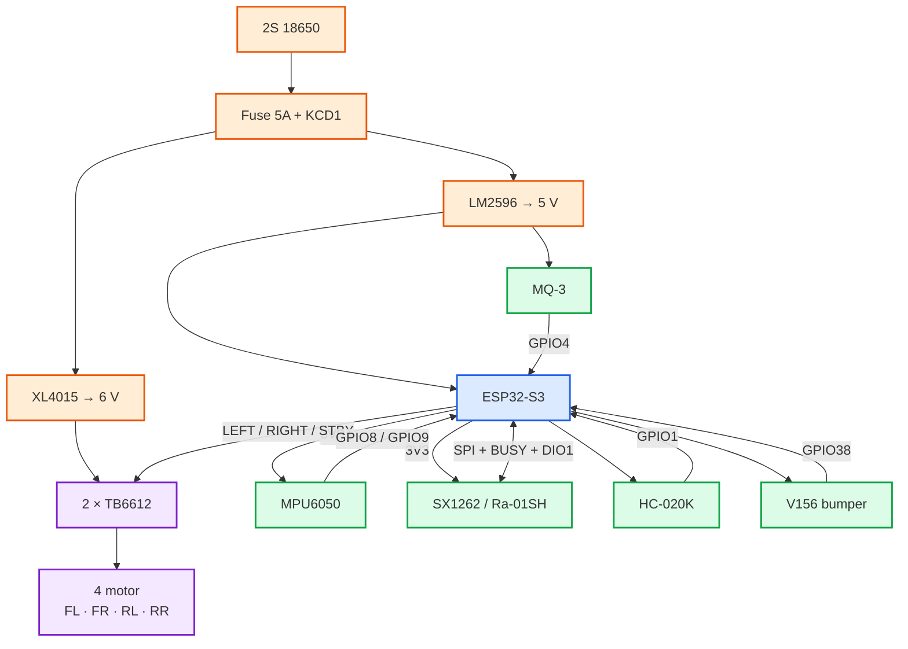

# GasSeeker — Visual Wiring Guide

Mục tiêu của thư mục này là để **cầm điện thoại/laptop bên cạnh xe và nối từng cụm**, không phải nhìn một sơ đồ khổng lồ đầy dây chồng lên nhau.

## Dùng theo thứ tự này

1. [`esp32-pinout.svg`](esp32-pinout.svg) — tìm đúng chân vật lý trên board ESP32-S3 màu hồng.
2. [`power.md`](power.md) — đấu nguồn trước.
3. [`motor.md`](motor.md) — đấu 2 TB6612 và 4 motor.
4. [`sensors.md`](sensors.md) — đấu encoder, MPU6050, MQ-3 và bumper.
5. [`lora.md`](lora.md) — đấu SX1262 / Ra-01SH cuối cùng.

> Hai file SVG `power-wiring.svg` và `signal-wiring.svg` là bản cũ, quá nhiều đường dây nên **không khuyến nghị dùng để ráp xe nữa**. Các file Mermaid ở trên là bản thay thế.

---

## Tổng quan hệ thống

Sơ đồ này chỉ để hiểu kiến trúc, **không dùng để cắm từng dây**.

---

## Quy tắc khi ráp

- **Không ráp tất cả một lượt.** Hoàn thành `power.md` rồi đo điện áp trước.
- Sau đó làm `motor.md`, test motor khi bánh đang kê khỏi mặt đất.
- Sau đó mới nối sensor và LoRa.
- Tất cả các khối dùng **GND chung**.
- LoRa chỉ dùng **3V3**, không cấp 5 V.
- MQ-3 AO phải qua divider 10k/20k trước GPIO4.

## Cấu hình phần cứng hiện tại

- 4 motor vàng V1
- 2 × TB6612FNG
- 1 × HC-020K trên GPIO1
- MPU6050 trên GPIO8/9
- MQ-3 trên GPIO4 qua divider
- 1 bumper trên GPIO38
- SX1262 / Ra-01SH trên GPIO10/11/12/13/14/21/47
