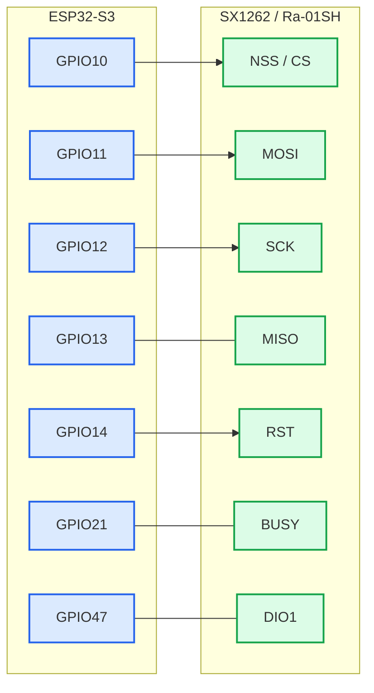

# GasSeeker — LoRa wiring

Sơ đồ này chỉ dành cho **ESP32-S3 ↔ SX1262 / Ra-01SH**.

## Bảng nối trực tiếp

| ESP32-S3 | SX1262 / Ra-01SH |
|---|---|
| GPIO10 | NSS / CS |
| GPIO11 | MOSI |
| GPIO12 | SCK |
| GPIO13 | MISO |
| GPIO14 | RST |
| GPIO21 | BUSY |
| GPIO47 | DIO1 |

Nguồn LoRa xem `power.md`:
- `VCC → 3V3`.
- `GND → GND chung`.
- Gắn antenna trước khi cấp nguồn.
