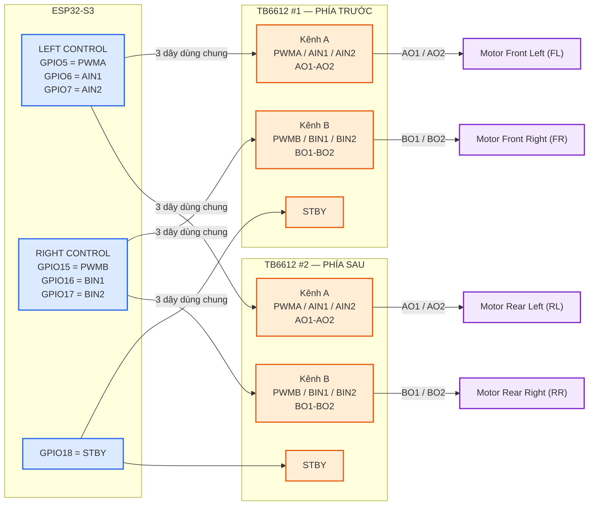

# GasSeeker — Motor wiring

Sơ đồ này chỉ dành cho **ESP32 → 2× TB6612 → 4 motor**.

## Bảng nối nhanh

| ESP32 | TB6612 #1 | TB6612 #2 | Ý nghĩa |
|---|---|---|---|
| GPIO5 | PWMA | PWMA | PWM bên trái |
| GPIO6 | AIN1 | AIN1 | chiều bên trái |
| GPIO7 | AIN2 | AIN2 | chiều bên trái |
| GPIO15 | PWMB | PWMB | PWM bên phải |
| GPIO16 | BIN1 | BIN1 | chiều bên phải |
| GPIO17 | BIN2 | BIN2 | chiều bên phải |
| GPIO18 | STBY | STBY | bật/tắt driver |

## Motor nào vào output nào

- TB6612 #1 `AO1/AO2` → Front Left.
- TB6612 #1 `BO1/BO2` → Front Right.
- TB6612 #2 `AO1/AO2` → Rear Left.
- TB6612 #2 `BO1/BO2` → Rear Right.

> Mỗi motor dùng một cầu H riêng. Không ghép hai motor vào chung AO1/AO2 hoặc BO1/BO2.
