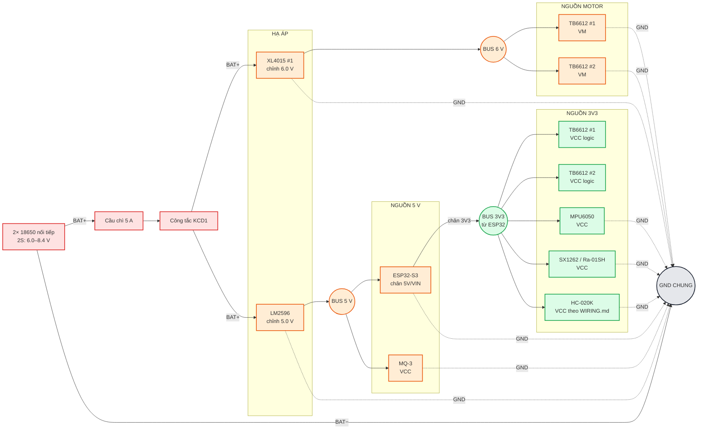

# GasSeeker — Power wiring

Dùng sơ đồ này **chỉ để đấu nguồn**. Chưa đấu GPIO ở bước này.

## Thứ tự đấu

1. `2S 18650 (+) → Fuse 5A → KCD1`.
2. Sau KCD1 chia thành hai nhánh: `XL4015 #1` và `LM2596`.
3. **Chưa cắm module**, chỉnh XL4015 = `6.0 V`, LM2596 = `5.0 V` bằng đồng hồ.
4. 6 V chỉ vào `VM` của hai TB6612.
5. 5 V vào `ESP32 5V/VIN` và `MQ-3 VCC`.
6. Dùng chân `3V3` của ESP32 cấp phần logic/sensor 3V3.
7. Tất cả GND phải nối về cùng một bus GND.

> Không cấp 5 V cho SX1262 / Ra-01SH.
