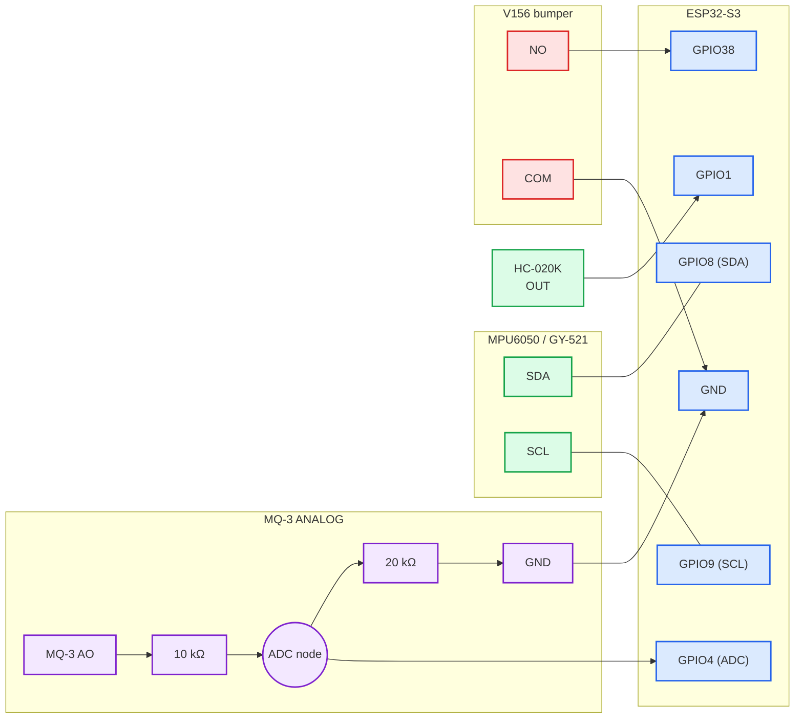

# GasSeeker — Sensor wiring

Sơ đồ này chỉ dành cho **HC-020K + MPU6050 + MQ-3 + bumper**.



## Nối từng cụm

### HC-020K
- `OUT → GPIO1`.
- `GPIO2` không dùng.

### MPU6050
- `SDA → GPIO8`.
- `SCL → GPIO9`.
- VCC/GND xem `power.md`.

### MQ-3

```text
MQ-3 AO ── 10 kΩ ──┬── GPIO4
                    │
                  20 kΩ
                    │
                   GND
```

Không nối MQ-3 AO trực tiếp vào GPIO4.

### Bumper V156
- `COM → GND`.
- `NO → GPIO38`.
- `NC` không dùng.
- `GPIO39` không dùng.
